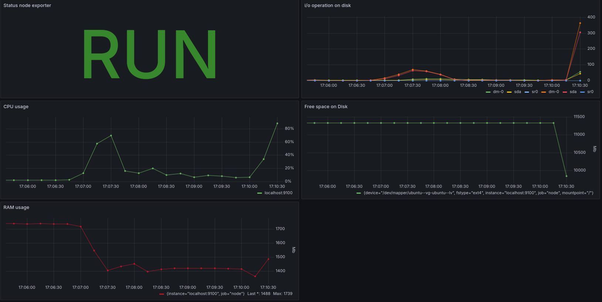
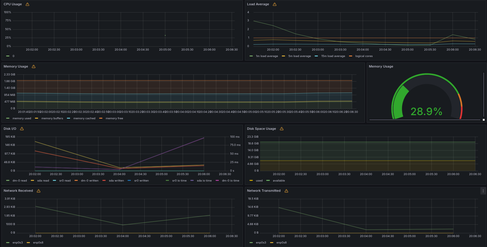

# Мониторинг
## Part 7. **Prometheus** и **Grafana**
### Решение:
- `Prometheus` уставновлен через `apt-get install prometheus`, `Grafana` скачен пакет deb и прокинут через `scp` на виртуальную машину и установлен через команду `sudo dpkg -i grafana-enterprise_VERSION_PACKAGE.deb.
- Дашборд составлен, используя `Node Exporter` и его метрики:
    - CPU(%): `100 - (avg by (instance) (irate(node_cpu_seconds_total{job="node",mode="idle"}[5m])) * 100)`
    - RAM(Mb): `(node_memory_MemTotal_bytes - node_memory_Active_bytes) / 1024 / 1024`
    - ROM: `(node_filesystem_avail_bytes{mountpoint="/"})/1024/1024`
    - Kол-во операций ввода/вывода на жестком диске:    
    Операции ввода - `sum (rate(node_disk_writes_completed_total[1m])) by (device)`
    Операции вывода - `sum (rate(node_disk_reads_completed_total[1m])) by (device)`
- Внешний вид дашборда: \
 

-  Запуск bash-скрипта из [Части 2](#part-2-засорение-файловой-системы)
 Посмотреть на нагрузку жесткого диска (место на диске и операции чтения/записи) \

- Результат выполнения `stress -c 2 -i 1 -m 1 --vm-bytes 32M -t 10s` \
 

## Part 8. Готовый дашборд

**Решение:**

- Установленный дашборд *Node Exporter Quickstart and Dashboard*: \
 

- Провести те же тесты, что и в [Части 7](#part-7-prometheus-и-grafana)
    - Показания дашборда при запуске `stress -c 2 -i 1 -m 1 --vm-bytes 32M -t 10s` \
     
    - Показания дашборда при выполнение скрипта из 7-ой части. \
 

- Запустил ещё одну виртуальную машину в общей сети `192.168.57.0/24`
- Запустил тест нагрузки сети с помощью утилиты **iperf3** \
 

- Нагрузка сетевого интерфейса \
 

## Part 9. Свой *node_exporter*

**== Задание ==**

Написать bash-скрипт или программу на Си, которая собирает информацию по базовым метрикам системы (ЦПУ, оперативная память, жесткий диск (объем)).
Скрипт или программа должна формировать html страничку по формату **Prometheus**, которую будет отдавать **nginx**. \
Саму страничку обновлять можно как внутри bash-скрипта или программы (в цикле), так и при помощи утилиты cron, но не чаще, чем раз в 3 секунды.

##### Поменять конфигурационный файл **Prometheus**, чтобы он собирал информацию с созданной вами странички.

##### Провести те же тесты, что и в [Части 7](#part-7-prometheus-и-grafana)